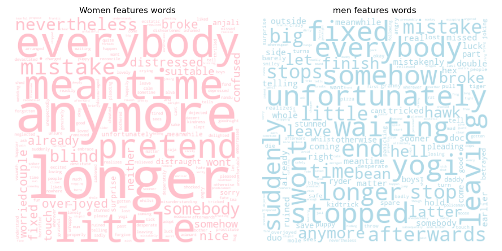
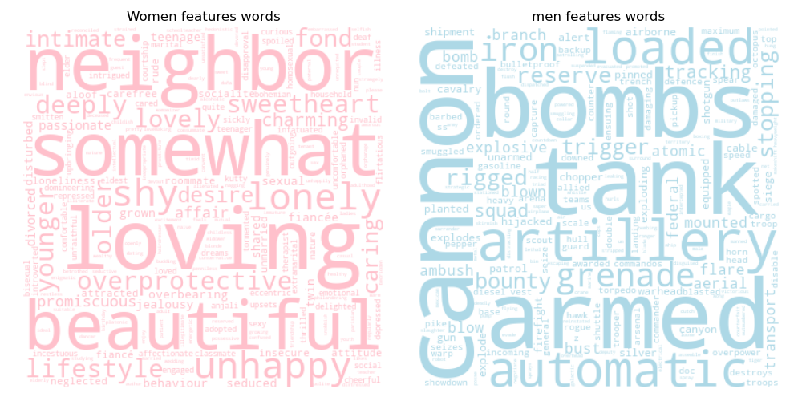

Now that we have explored the general representation of women in movies we were wondering how they were described and if the way they were described differed a lot between men and women. To do so we analysed the words of the movie summaries using a bag of words (machine learning) on the movie summaries, as words carry lots of information. Once the model was trained we were able to compare words that were more similar to women and others which were more similar to men. 
Firstly we look at the adjectives the most used to describe women and how different they are between women and men. Secondly we wanted to see if women were associated to different jobs than men and if so which jobs they were. Finally we did a sentiment analysis to observe whether women were described with more intense sentiments than men.

First of all we were wondering the proportion of time women were represented in summaries compared to men. For this we simply counted the occurence of words describing women and the occurence of words describing men.



Women appear 27.6 % of the time which even lower that the proportion of feminine characters which are at 33.3% for this dataset. So apparently not only there are much less women characters there are even lower appearance in the movies. However no statistical test was made so we can't be sure.

# Adjectives analysis

The following two word clouds show adjectives associated with women and associated with men for words appearing more than 50 times in the dataset.

It's hard to take any conclusion out of this word of cloud in effect words that are related to woman can also be related to men. Thanksfully we don't observe any shocking differences even if we observe a funny opposition where words related to women contain mistake and broke and the men dataset contain fixed. However it is hard to see a difference.We thus decided to focus on the adjectives with the biggest differences regarding which gender they are used for. The results are displayed just below.

Even though our model also identified some words as adjectives which are not truly adjectives, such as "tank" or "cannon", the results are still very interesting. We can see that women are described with more soft and positive words, while men are described with words related to conflict and war. The differences that are observed are around  0.25 in cosine similarities. Those differences are not huge but still represent bias in the way movies are describing men and women.
The two barplots below depict the same information as the word cloud above, but they show in more detail how large the differences between men and women are for each of the words.





Now that we have seen that there are some differences in adjectives used to describe man or women we want to see if they are differences in the jobs they are doing as well. 

# Jobs analysis

To assess the difference in occupations between men and women we use the same methodology as for the adjectives. When looking at which jobs vary the most between women and men in movies, we can find similar results as with the adjectives above. Women are mostly doing graceful and artsy jobs, such as  dancer or painter, while men are more prone to have jobs related to conflict and authority, such as deputy or general. 

In both case it seemed like women were related to words more sentimental and emotional. Let's see if there is an actual difference in sentiments between them.

# Sentiment analysis

We did a sentiment analysis to see if there are differences in sentiments between words representing men and words representing women. We separated the data by sentences using spacY and did sentiment analysis on the sentences using nltk vader. Then we extracted the adjectives from the previous parts and associated them with the sentiment of the sentence they were into. 
The sentiment extracted were either positive negative or neutral. To look whether the sentiments were more associated women or with men we did a ordinary least square regression with the x variable being the difference between cosine correlation for men and women and the y variable the sentiment score. This regression was made for positive, negative and neutral score. However the correlation found between those variables for each sentiment was very small (R-square inferior to 0.05). Thus there is no linear correlation between this difference and the sentiment scores. However we observed that for words with higher differences there were less incertitude in the scores. We then observed the differences between words that had an absolute differences between men and women higher than 0.15.
Gender difference in positive sentiment scores:



We notice that women have a higher score. A t-test to check if those difference were significant was made and effectively it is significant !

Let's now look at the negative score :



And the neutral score :



In both case men have a statistically significant higher score than women. 
We have thus shown using the words in the summaries of the movies that women are described differently than men in those movies. 
But do this depiction evolve over time ?  You can find out more about this [here](/Women_and_movies/time/).

